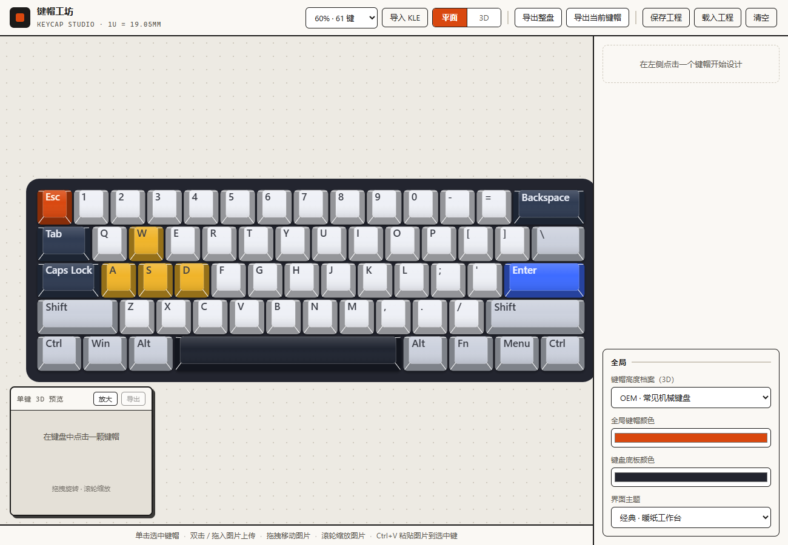
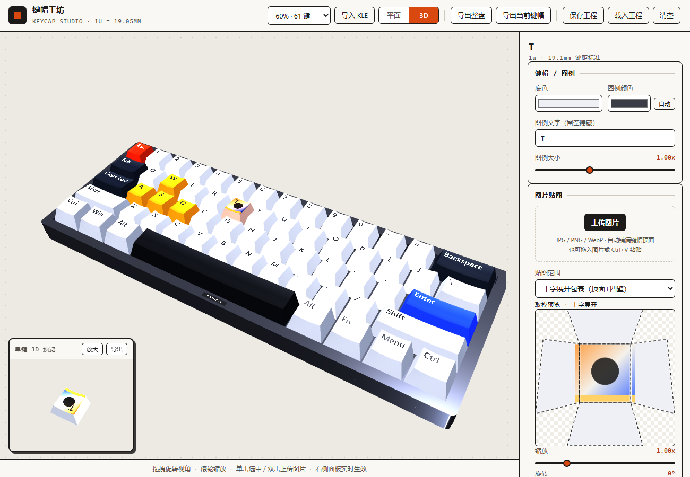
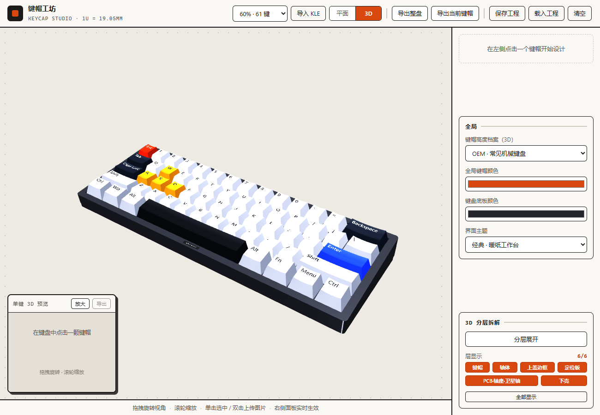
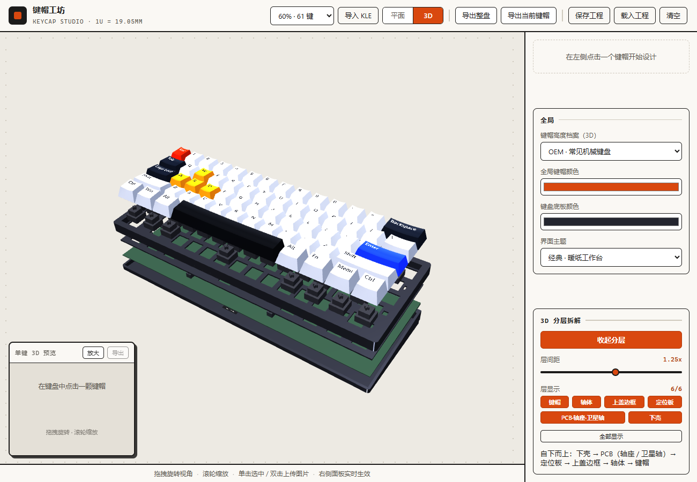
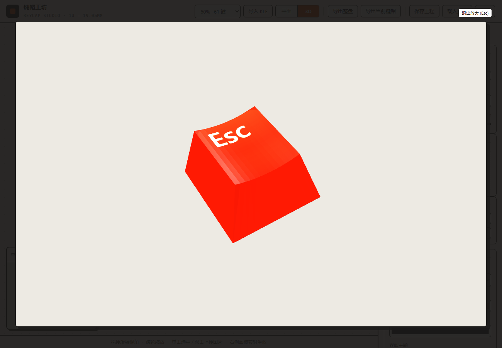
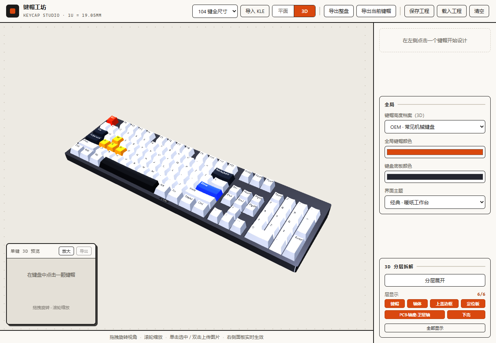

# Keycap Studio (键帽工坊)

[简体中文](README.md) · **English**

> Design mechanical keyboard keycaps key by key in the browser — base color, legends and image artwork, live 2D / 3D preview, one-click exploded view, PNG export and project files.

Keycap Studio is a **pure front-end keycap design tool**: the keyboard sits on the left, the design panel on the right. Click a key, change how it looks, and see the result immediately in both the flat layout and the 3D model. No server, no network — great for designing a keycap set, testing color combinations, wrapping artwork onto keycaps, or just exploring the proportions of a mechanical keyboard.

Tech stack: Vue 3 + Vite + Three.js (fully client-side, works offline).

## Screenshots

|  |  |
|---|---|
| <br>**Flat view** — per-key base color and legends; switch layout / 2D · 3D from the toolbar | <br>**Image artwork** — wrap an image around a keycap; the panel shows the real paper pattern |
| <br>**3D board** — per-row heights and tilts, full chassis (case / plate / PCB / switches) | <br>**Exploded view** — six layers, adjustable spacing, per-layer visibility |
| <br>**Single-key 3D zoom** — inspect one keycap full screen and export it | <br>**Four built-in layouts** — 60% / 75% / TKL / 104 keys, plus KLE import |

---

## 1. What it does

| Feature | Description |
|---|---|
| **Keyboard layouts** | Built-in 60% (61 keys) / 75% (87 keys) / TKL (87 keys) / full size (104 keys); import custom layouts from KLE |
| **Per-key design** | Base color, legend text, legend color (auto contrast against the base color), legend size |
| **Image artwork** | Put an image on a keycap: **top only** or **cross-unwrap** (top + all four sides); scale, rotate and offset |
| **Unwrap preview** | Shows the keycap's **true cross-unwrap paper pattern**; drag the artwork directly on the pattern and the 3D preview follows |
| **Flat preview** | Canvas 2D top view sharing the **exact same dimensions** as the 3D model — outline and top face line up point by point |
| **3D preview** | Keycaps with per-row heights and tilts, plus a complete chassis: switch plate, PCB, hot-swap sockets, stabilizers, top and bottom case, feet |
| **Height profiles** | Five profiles — OEM / Cherry / SA / DSA / XDA; switching rebuilds the whole board |
| **Exploded view** | Spread the board into layers like floors and toggle each one, to inspect keycaps / switches / top case / plate / PCB / bottom case |
| **Export** | Whole-board PNG (flat top view or current 3D view), current keycap PNG, single-key 3D render |
| **Persistence** | Auto-saved to the browser (restored on refresh); export / import a `.json` project file to move between machines |

### Details

- **Layouts**: switching layouts **migrates** your work automatically — keys with the same label and size keep their design, the rest fall back to the default style; "Clear" resets the whole board to defaults.
- **Legends**: leave the text empty to hide it (like the spacebar); the "Auto" color picks a dark or light legend based on the base color so contrast is always readable; size 0.5x–1.8x.
- **Uploading images (four ways)**: the panel button, double-clicking a keycap, dragging an image onto the canvas, or pasting from the clipboard with Ctrl+V; JPG / PNG / WebP are supported.
- **Artwork transform**: scale 0.2x–4x, rotate ±180°, horizontal / vertical offset; in flat mode you can also zoom by scrolling on a keycap.
- **Cross-unwrap**: the image wraps over the top face and continues onto all four sides, staying continuous across the folds; replacing the image keeps the current wrap mode.
- **The unwrap preview is a true unfolding** (isometric, not a projection): the top face uses its real edge length (`top depth / cos(tilt)`) and each wall is rotated flat around its own fold — so with a tilted top the east / west walls are necessarily skewed wedges (only 0° profiles like DSA / XDA give equal-height trapezoids).
- **3D chassis**: modeled to real specs — plate with 14mm cutouts and stabilizer holes, hot-swap sockets, stabilizers (housing + through-plate stem + Ø1.6mm wire), 1.6mm PCB, USB-C receptacle (with tongue inside the mouth) and rubber feet; the case bottom is a 6° wedge that rests flat on the desk while the keycap plane stays level.
- **Keycap shape**: single straight tapered skirt + per-row tilt + dished top, with a stem boss and cross slot underneath (extra bosses at stabilizer positions for large keys and the spacebar).
- **Exploded view**: six layers bottom-up — bottom case → PCB (sockets / stabilizers) → switch plate → top case frame → switches → keycaps. Layer spacing 0.4x–2x applies live, the animation is eased, the state survives profile changes, and every layer can be shown / hidden individually (hide the keycaps to inspect switches, hide the bottom case to look into the cavity). Hidden keycaps are not clickable.
- **Key-field web**: a layer of case plastic at the rim height — the area around the key field and any place your layout really has no key (blank cells, gaps between blocks, e.g. between the F-row and the navigation cluster on an 87-key board) is case material; **there is no divider between adjacent keycaps**.
- **Export sizes**: board and single-key exports render at 2x; the single-key 3D export is rendered with a long edge of ≥1024px (the on-screen card is tiny), so the output stays crisp.

---

## 2. Getting started

1. **Pick a layout** — switch between 60% / 75% / TKL / 104 in the toolbar, or load your own with "Import KLE";
2. **Pick a keycap** — click a key on the board; the right panel shows its design options;
3. **Design it** — set the base color, type a legend, add an image (double-click the keycap, drag an image in, or press Ctrl+V);
4. **Check the result** — switch between "Flat / 3D"; in 3D you can orbit, zoom, and use "Exploded view" to look at the internals layer by layer;
5. **Take it away** — "Export board / Export keycap" for PNGs, "Save project" for a `.json` file.

---

## 3. UI layout

| Area | Contents |
|---|---|
| Top toolbar | Layout switch, KLE import, flat / 3D toggle, export (board / current keycap), save / load project, clear |
| Left canvas | Main keyboard view + the always-visible "single-key 3D preview" card + a hint bar at the bottom |
| Right panel | A hint when nothing is selected; the selected key's design options (keycap / legend, artwork, shortcuts) once it is; "Global" and "3D exploded view" settings are always at the bottom |

---

## 4. Interaction cheat sheet

| Action | Flat mode | 3D mode |
|---|---|---|
| Select a keycap | Click | Click |
| Upload an image | Double-click a keycap / drag in / Ctrl+V | Double-click a keycap / drag in / Ctrl+V |
| Move the artwork | Press and drag | Drag inside the unwrap preview (3D follows) |
| Zoom the artwork | Scroll wheel over the keycap | Panel slider |
| Orbit / zoom the view | — | Drag / scroll wheel |
| Inspect one key | "Zoom" on the bottom-right card (Esc to exit) | Same |

---

## 5. Specs & data

### 5.1 Dimensions

- Key pitch: **1u = 19.05mm**.
- The keycap outline is inset by `gap` (0.5mm) per side from its key cell, and the top face is inset again by `xi` (left/right) and `zi` (front/back). All three are **fixed millimetre values** and do not scale with key width — so an OEM 1u top face is ≈ `0.643u × 0.738u` (slightly deeper front-to-back), and a wide key's top face = key width − 2 × (gap + xi).
- The flat view and the 3D model share the same parameters: the outline and top-face rectangle match the 3D bottom ring / top ring point by point.

### 5.2 Keycap height profiles (mm, as `[height, tilt°]`)

| Profile | F row | R1 number row | R2 Q row | R3 home row | R4 Z row | Bottom row / spacebar |
|---|---|---|---|---|---|---|
| OEM | 11.2, 3 | 9.45, -1 | 9.0, -6 | 9.25, -9 | 9.25, -10 | 11.2, 3 |
| Cherry | 9.8, 0 | 9.8, 0 | 7.45, -2.5 | 6.55, -5 | 7.35, -11.5 | 7.35, -11.5 |
| SA | 14.89, 13 | 14.89, 13 | 12.925, 7 | 12.5, 0 | 12.925, -7 | 12.5, 0 |
| DSA | 8.1, 0 (uniform, spacebar included) | | | | | |
| XDA | 8.4, 0 (uniform, spacebar included) | | | | | |

Values come from KeyV2 (R1–R4 = row 1–4, F row and bottom row / spacebar = row 0/5), with the tilt sign flipped to this table's convention (positive = front edge lower). **The spacebar must use the same spec as its row**: for OEM that row is the tallest on the board at 11.2mm (same as the F row); DSA / XDA are uniform. The 3D keycaps and the unwrap preview share this data, so both unfold to the same size.

### 5.3 Project file format (`.json`)

```json
{
  "v": 1,
  "layoutName": "60",
  "customRows": null,
  "plateColor": "#23252f",
  "profile": "oem",
  "designs": {
    "0": { "bg": "#eef0f6", "legend": "Esc", "legendColor": null,
           "legendSize": 1, "img": null },
    "5": { "bg": "#ff8800", "legend": "5", "legendColor": null,
           "legendSize": 1,
           "img": { "data": "data:image/png;base64,...", "wrap": "net",
                    "scale": 1, "rot": 0, "ox": 0, "oy": 0 } }
  }
}
```

- `designs` is keyed by key index; `img.data` is the image data URL (base64), so projects with artwork can get large.
- `legendColor: null` means auto contrast; `img.wrap` is `"top"` (top face only) or `"net"` (cross-unwrap).
- Missing fields on load fall back to defaults.

### 5.4 KLE import format

- Standard Keyboard Layout Editor JSON is accepted: a **2D array** where string elements are 1u keys and object elements are modifiers (`{w, h, x, y, ...}`);
- `{ "keys": [...] }` and `{ "rows": [...] }` wrappers are accepted too;
- After importing it shows up as "KLE custom layout" in the layout dropdown.

---

## 6. Notes

- Images are stored as base64 inside both the project file and the local autosave: more or bigger images mean bigger projects. Autosave has a browser storage quota and silently skips when exceeded (manual "Save project" still works — prefer project files when you have lots of artwork).
- With cross-unwrap the artwork is centred on the **top face** and extends onto the walls; to control what appears on the sides, adjust scale and offset, or drag directly in the unwrap preview.
- Use images whose aspect ratio is close to the keycap top face; very small images will look blurry when scaled up.
- Switching layouts and "apply to all keys" keep artwork (migration matches by key label + size; unmatched keys use the default style).
- Refreshing restores the autosave; "Clear" only resets the design and does not wipe the browser save — edit after clearing and the new state is autosaved.
- Exported PNGs do not include editing overlays such as the selection highlight.

---

## 7. Run & build

Requirements: **Node.js ≥ 18**.

```bash
npm install        # install dependencies (vue / three / vite)
npm run dev        # start the dev server; the local URL is printed in the terminal
npm run build      # build the static site into dist/
npm run preview    # preview the dist/ build locally
```

The build output is plain static files that reference each other with relative paths, so `dist/` can be deployed to any static server, subdirectory or GitHub Pages with no extra configuration.

### Project structure

| Path | Description |
|---|---|
| `index.html` | Page entry |
| `src/main.js` | App entry: mounts the root component, imports global styles |
| `src/App.vue` | Root component: overall layout, provides shared state downwards |
| `src/components/` | Single-file components: toolbar, canvas area, single-key 3D card, keycap / artwork / shortcuts / global / exploded-view cards, zoom overlay, toast |
| `src/composables/useStudio.js` | App state and every interaction (Composition API) |
| `src/lib/layout.js` | Layouts: KLE parsing, built-in layouts, keycap height profiles |
| `src/lib/render.js` | Flat (Canvas 2D) keycap rendering |
| `src/lib/preview3d/` | 3D preview modules: spec tables, textures, unwrap mapping, keycap geometry, chassis assembly, view |
| `src/styles/style.css` | Global styles (two themes) |
